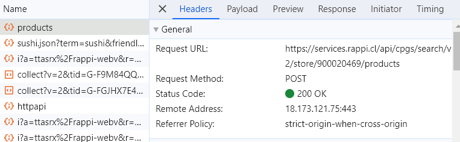
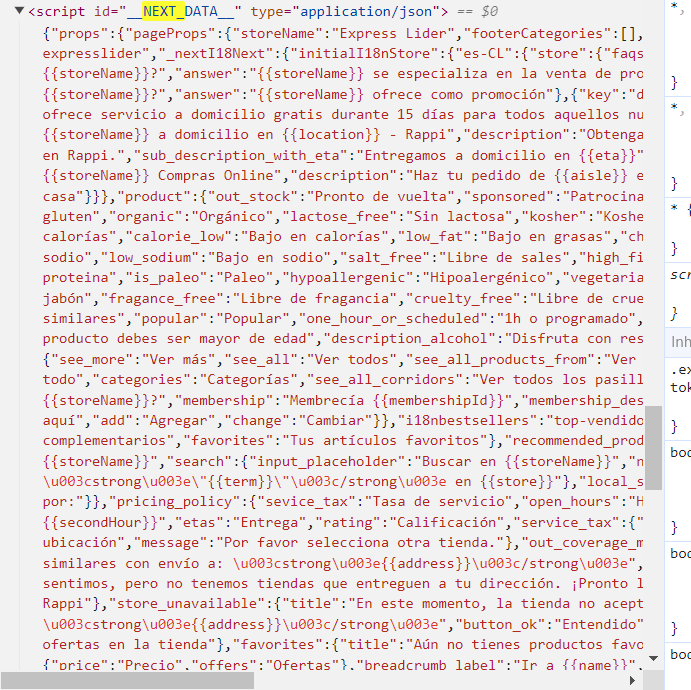

# Rappy Scraper Solution
* This applicaiton is developed with the assistance of Gemini 2.5

### Dependencies: Python Requests
  
### My journey
Initially I tried to directly access Rappi's product API but encountered authentication issues.

 After updated instructions, I discovered another approach by analyzing the network requests during product searches.

I noticed that the Rappi's webpage uses Next.js to embeds all product data directly in the script id "__NEXT_DATA__". This allowed me to extract structured JSON data directly without HTML parsing.

# Steps
1. Make request to the search page URL
2. Extracts the embedded JSON using regex
3. Traverse JSON structure to find product information
4. Formats the data accordingly

### Note: 
Somehow I coudn't connect to the proxy, so I added the option to default with not using it. This allowed the script to run without issues.

